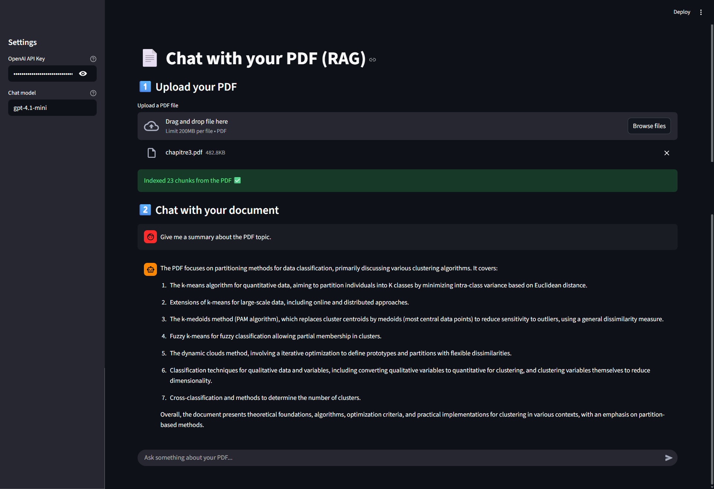

# PDF RAG Chat App

This Streamlit app lets you upload a PDF and chat with it using RAG
(Retrieval-Augmented Generation) and an LLM.

## Demo

## How to Use

1.  Install dependencies:

        pip install -r requirements.txt

2.  Run the app:

        streamlit run app.py

3.  Enter your OpenAI API key in the sidebar.

4.  Upload a PDF. The app will extract and index the text.

5.  Ask questions in the chat box. The model will answer using the PDF
    content.
